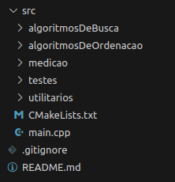
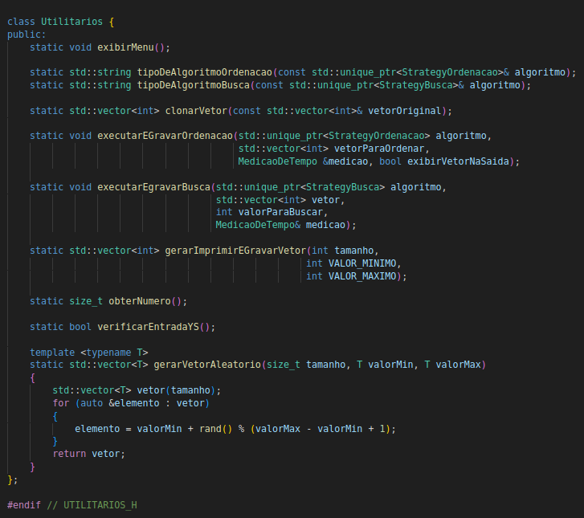

# Projeto Final

## Resumo do Projeto

O projeto consiste na modificação de um código que mede o tempo de execução de algoritmos clássicos de busca e ordenação, desenvolvido originalmente para a disciplina de Estrutura de Dados Básicas. O código foi refeito com o objetivo de torná-lo uma experiência interativa para o usuário por meio do terminal.

As boas práticas utilizadas no desenvolvimento do projeto incluem: Clean Code, Programação Defensiva, Testes de Software e a aplicação do Padrão de Projeto Strategy.

## Descrição do Projeto

Este projeto tem como objetivo modificar um código desenvolvido inicialmente para a disciplina de Estrutura de Dados Básicas II. O código original foi criado para implementar algoritmos clássicos de busca e ordenação, além de calcular seus tempos de execução para diferentes tamanhos de entrada. Apesar de funcional, o código tinha um propósito restrito e pouca interação com o usuário.

Para torná-lo mais robusto e interativo, o projeto foi reestruturado com a aplicação de boas práticas. O novo código permite que o usuário interaja diretamente por meio do terminal, escolhendo os algoritmos a serem executados, definindo o tamanho do vetor de entrada e visualizando os tempos de execução.

A nova versão foi desenvolvida seguindo os princípios do Clean Code, garantindo maior legibilidade e flexibilidade. Como o programa agora possui interação com o terminal, foram implementadas validações de entrada para evitar erros, seguindo os conceitos da Programação Defensiva. Além disso, foram adicionados testes unitários utilizando o framework Google Test, para garantir que os algoritmos estejam funcionando corretamente. Por fim, o padrão de projeto Strategy foi utilizado, facilitando a alternância entre os algoritmos e garantindo maior organização e flexibilidade para futuras modificações.


## compilar e executar

1. **Navegue até a pasta `src/`**:

   Acesse a pasta onde o código fonte do projeto está localizado.

   ```bash
   cd projetoFinalBoasPraticas-main/src
   ```
2. **Execute, na pasta, o seguinte comando:**

    ```bash 
    cmake -B build 
    cmake --build build
    ```
3. **Depois, na pasta build, faça isso:**

    Para rodar os testes:
    ```bash 
    ./rodarTestes 
    ```
    Para rodar a main:
    ```bash
    ./menuPrincipal
## Vídeo:
O vídeo apresenta as melhorias da nova versão do código, comparando com a original, explicando mudanças e demonstrando seu funcionamento.
[Assista aqui](https://www.loom.com/share/030e55c9da86435dafe00a38e6479b74?sid=ae19ee18-854f-447f-a66c-8ef6790a9a0f)

## Comparação

### Clean Code:

No desenvolvimento desta nova versão do código, os princípios do Clean Code foram utilizados para garantir uma maior organização e legibilidade. Utilizamos uma nova organização do código, focando em sempre utilizar nomes autoexplicativos e repartindo métodos com mais de uma responsabilidade. Isso facilitou a manutenção e a compreensão do código, além de tornar a aplicação mais flexível.

### Exemplos:

| **Arquivos Originais**                | **Arquivos Nova Versão**           |
|------------------------------------|------------------------------------|
|  |  |

Outro exemplo é a função `executarTeste` do código original. Ela tinha muitas responsabilidades, o que dificultava qualquer alteração que precisasse ser feita. No novo código, implementamos uma classe chamada `Utilitarios.h`, onde os métodos estão bem definidos e organizados para serem utilizados de forma clara e eficiente.

| **Função executarTestes**                | **Utilitarios.h**           |
|------------------------------------|------------------------------------|
|  |  |

### Programação Defensiva:

No código original, havia uma interação simples com o terminal, onde o usuário podia escolher o tipo de algoritmo a ser executado (busca ou ordenação). No entanto, com as modificações realizadas na nova versão, o programa se tornou mais interativo, permitindo que o usuário defina diversas entradas, como o algoritmo específico a ser executado, o tamanho do vetor, o elemento a ser buscado (caso esteja utilizando um algoritmo de busca) e se deseja ou não visualizar o vetor de saída. Todas essas interações são feitas por meio do terminal.

Com a inclusão dessas novas funcionalidades, foi necessário adicionar validações para garantir que entradas inválidas não causassem falhas no programa. Por exemplo, ao escolher um algoritmo, o usuário deve fornecer um número inteiro correspondente à opção desejada. Caso o número fornecido não seja mapeado para uma opção válida, uma mensagem de erro é exibida, assegurando que o programa continue funcionando corretamente sem ser interrompido por uma entrada inválida.

### Exemplo:

| **Validação de Entradas**            |
|------------------------------------|
|  |

### Teste de Software 

Como o projeto envolve a execução de algoritmos de busca e ordenação, é essencial garantir que eles funcionem corretamente. No projeto original, os testes eram realizados em arquivos separados, como `testes_busca.cpp` para os testes de busca e `testes_sort.cpp` para os testes de ordenação. Na versão atual, todos os testes foram unificados em um único arquivo, `testes.cpp`, utilizando o framework Google Test. Isso facilita tanto a implementação dos testes quanto a visualização dos resultados.

### Exemplo:

| **Testes Google Tests**            |
|------------------------------------|
|  |

### Padrão de Projeto Strategy

O padrão de projeto Strategy foi utilizado para permitir a alternância dinâmica entre os algoritmos de busca e ordenação. No projeto original, a escolha do algoritmo era rígida e não flexível. Na versão atual, a aplicação do Strategy, com a implementação das classes `StrategyBusca` e `StrategyOrdenacao`, permite que diferentes algoritmos sejam facilmente trocados. A classe Contexto foi criada para gerenciar essas estratégias e delegar a execução dos algoritmos de busca e ordenação. Isso facilita a manutenção, a troca de algoritmos e a adição de novos, sem impactar o restante do código.

| **StrategyBusca.h**                | **StrategyOrdenacao.h**           |
|------------------------------------|------------------------------------|
|  |  |

